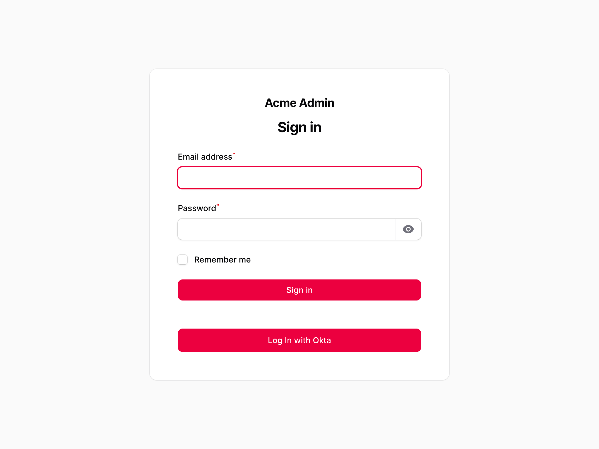

# Filament Okta

[](https://packagist.org/packages/bbs-lab/filament-okta)
[](https://github.com/BBS-Lab/filament-okta/actions/workflows/run-tests.yml)
[](https://packagist.org/packages/bbs-lab/filament-okta)

Okta SSO for Filament. An **activatable-per-panel plugin** that adds a **Log In with Okta** button to a panel's login screen and wires its login / callback / logout flow — so each panel can run its own Okta configuration. The button is rendered with Filament's own button component, so it inherits each panel's branding (primary colour, radius, dark mode).

It is the Filament adapter for [bbs-lab/laravel-okta](https://github.com/BBS-Lab/laravel-okta), which is installed automatically and owns the framework-agnostic Okta flow: the Socialite driver, the login / callback / logout controller, the user resolver, and the lifecycle hooks.



## Requirements

- PHP 8.2+
- Laravel 11, 12 or 13
- Filament 5

## Installation

```bash
composer require bbs-lab/filament-okta
```

Both service providers are auto-discovered.

### Activate the plugin on a panel

```php
use BBSLab\FilamentOkta\OktaPlugin;
use Filament\Panel;

public function panel(Panel $panel): Panel
{
    return $panel
        // …
        ->login()
        ->plugin(OktaPlugin::make());
}
```

### Okta application

In your Okta admin, create an **OIDC / Web** application and set:

- **Sign-in redirect URI**: `{APP_URL}/{panel-path}/authorization-code/callback`
- **Sign-out redirect URI**: `{APP_URL}/{panel-path}/authorization-code/callback/logout`

where `{panel-path}` is the panel's path (e.g. `admin`). These paths are configurable per panel — see [Per-panel configuration](#per-panel-configuration).

### Credentials

Add the `okta` block to `config/services.php` (the package intentionally does not own your credentials):

```php
'okta' => [
    'client_id' => env('OKTA_CLIENT_ID'),
    'client_secret' => env('OKTA_CLIENT_SECRET'),
    'redirect' => env('OKTA_REDIRECT_URI'), // optional — derived per panel from its callback route
    'base_url' => env('OKTA_BASE_URL'),
],
```

**`OKTA_REDIRECT_URI` is optional.** The redirect URI is a route this package generates, so it is
derived automatically — and because the plugin is per panel, **each panel derives its own** callback
(`/{panel-path}/authorization-code/callback`). You only declare each panel's matching **Sign-in
redirect URI** in Okta. A panel with its own Okta application registers its own Socialite driver and
`services.*` block; set a `redirect` there only to override the derived URL (e.g. behind a reverse proxy).

## Per-panel configuration

Because the plugin is activated per panel, each panel can carry its own Okta configuration. Any
option left unset falls back to the shared `config('okta.*')` of the base package.

```php
->plugin(
    OktaPlugin::make()
        ->socialiteDriver('okta-admin')   // a distinct registered driver (own Okta app)
        ->ssoLogout(true)                 // logout ends the Okta session (OIDC end-session)
        ->requireVerifiedEmail(true)      // reject unverified Okta emails
        ->identifierColumn('okta_id')     // match on the stable Okta "sub" first
        ->identifierUpdate(true)          // backfill the column on first verified match
        ->paths(                          // route paths (after the panel path); omit any to keep its default
            login: 'authorization-code/redirect',
            callback: 'authorization-code/callback',
            logout: 'authorization-code/logout',
            callbackLogout: 'authorization-code/callback/logout',
        ),
)
```

> `paths()` sets only the arguments you pass; the rest fall back to the shared `config('okta.paths.*')`
> then the built-in defaults above. The route **names** never change, so the login button and the
> derived redirect URI follow automatically — but a changed callback path must be re-whitelisted in Okta.

A second panel can activate the plugin with entirely different values — each panel mounts its own
`filament-okta.{panelId}.*` routes and resolves its own configuration per request.

### Using a distinct Okta application per panel

`socialiteDriver('okta-admin')` points a panel at a **separate** Socialite driver, which you must
register yourself (the package only registers the default `okta` driver). In a service provider:

```php
use Illuminate\Support\Facades\Event;
use SocialiteProviders\Manager\SocialiteWasCalled;
use SocialiteProviders\Okta\Provider;

Event::listen(fn (SocialiteWasCalled $event) => $event->extendSocialite('okta-admin', Provider::class));
```

and add the matching credentials block in `config/services.php`:

```php
'okta-admin' => [
    'client_id' => env('OKTA_ADMIN_CLIENT_ID'),
    'client_secret' => env('OKTA_ADMIN_CLIENT_SECRET'),
    'redirect' => env('OKTA_ADMIN_REDIRECT_URI'), // optional — derived from the panel callback
    'base_url' => env('OKTA_ADMIN_BASE_URL'),
],
```

If you name a driver that isn't registered, the login button redirect fails gracefully back to the
login screen with an error notification (rather than a 500).

## Routes

For each panel that activates the plugin, these routes are mounted. **Every URI is prefixed by that
panel's path** (`$panel->getPath()`, read at boot) — so a panel at `/backend-panel` gets
`/backend-panel/authorization-code/callback`. Below, `{panel-path}` is that prefix and `{panel}` is the panel id:

| Route (default URI) | Name | Purpose |
|-------------|------|---------|
| `GET {panel-path}/authorization-code/redirect` | `filament-okta.{panel}.login` | Redirects to Okta (start login). |
| `GET {panel-path}/authorization-code/callback` | `filament-okta.{panel}.callback` | Login callback — resolves the user and logs them in (the Sign-in redirect URI target). |
| `GET {panel-path}/authorization-code/logout` | `filament-okta.{panel}.logout` | Logs out locally, and — when SSO logout is on — via Okta's OIDC end-session. |
| `GET {panel-path}/authorization-code/callback/logout` | `filament-okta.{panel}.callback.logout` | Okta's post-logout landing. |

The `authorization-code/*` paths are **configurable per panel** via `OktaPlugin::make()->paths(...)` (see above). The route **names** use the panel **id** (stable whatever the path), so reference them with `route('filament-okta.'.$panel->getId().'.login')` rather than hard-coding a URI.

## User resolution, gating & lifecycle hooks

There is deliberately no user-mapping config — the base resolves an Okta account through the panel's
guard's own user provider (by a stable id column then a verified email, never creating a user), and
everything else is a hook on the `BBSLab\LaravelOkta\Facades\Okta` facade
(`resolveUserUsing`, `authorizeUserToLogin`, `beforeLogin`, `afterLogin`, `onLoginDenied`) or a
custom `BBSLab\LaravelOkta\Contracts\OktaUserResolver`.

> **The default resolver does not gate — it signs in any user it finds by email.** Deciding *who*
> may sign in is your job — and Filament's own `canAccessPanel()` is a separate layer (also
> permissive by default). Set both: gate the SSO login (`Okta::authorizeUserToLogin(...)`) **and**
> implement a real `canAccessPanel()`.

A denied or failed login is surfaced on the panel login screen as a **Filament danger
notification** (via `FilamentOktaPanel::flashError()`), so it looks native.

See the [bbs-lab/laravel-okta README](https://github.com/BBS-Lab/laravel-okta#user-resolution--lifecycle)
for the hooks, the stable-identifier config, and how to extend `DefaultOktaUserResolver` for a
reusable gate.

## Testing

```bash
composer test           # Pest (unit + feature)
composer test-coverage  # 100% line coverage on src/
composer analyse        # PHPStan level 8
composer format         # Pint
composer serve          # boot the workbench panels at http://localhost:8000/admin
```

### Browser & live e2e

The browser (Pest v4) and live Playwright suites cover the pre-redirect login UX (the Okta button
and the start of the OIDC redirect); the full SSO round-trip needs a real Okta org.

```bash
npm install && npx playwright install chromium   # once
composer test:browser                            # Pest v4 browser tests
npm run e2e                                       # live Playwright scenarios (auto-starts serve)
```

## Security

- **Verified emails.** The base's default resolver rejects unverified Okta emails (`require_verified_email`). If you replace the resolver, keep an equivalent check.
- **Logout is a `GET`**, so it relies on the framework's default `SESSION_SAME_SITE=lax`. Keep SameSite at `lax`/`strict`; if you set it to `none`, wire logout as a `POST` form instead.

Please email `paris@big-boss-studio.com` for security issues instead of the issue tracker.

## Changelog

See [CHANGELOG.md](CHANGELOG.md).

## Contributing

See [CONTRIBUTING.md](CONTRIBUTING.md).

## Credits

- [Big Boss Studio](https://github.com/BBS-Lab)

## License

The MIT License (MIT). See [LICENSE.md](LICENSE.md).
